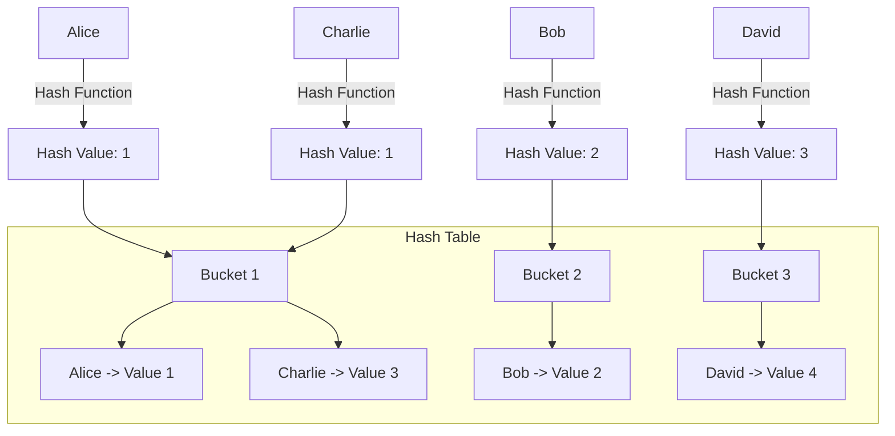

Hashing in Data Structures and Algorithms (DSA) is a technique used to map data of arbitrary size (keys) to fixed-size values (hash values) in a way that supports efficient insertion, deletion, and lookup operations
## Hash Tables
- Let, for a string, sum of characters' ASCII value is divided by their sum 
- The remainder is taken as hashing key
- So against each key there can be 1/more elements
- elements with the same hash key are stored in a linked list `(Hash Chaining)`

### Diagram Explanation:
1. **Keys** (e.g., "Alice", "Bob", etc.) are input into the **hash function**, which generates a **hash value**.
2. The **hash value** determines the **bucket index** in the hash table.
3. Multiple keys (e.g., "Alice" and "Charlie") can map to the same bucket due to collisions. These are managed using **chaining** (storing items in a list at the bucket index).

